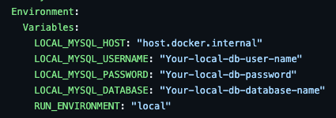
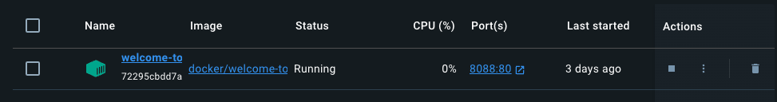
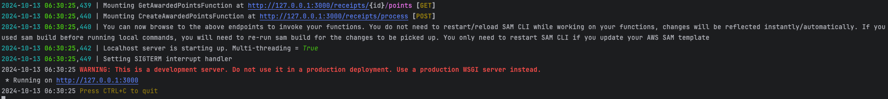
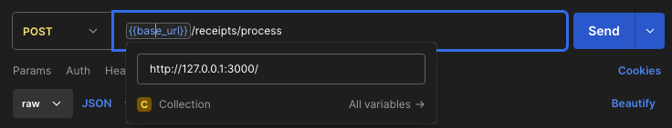
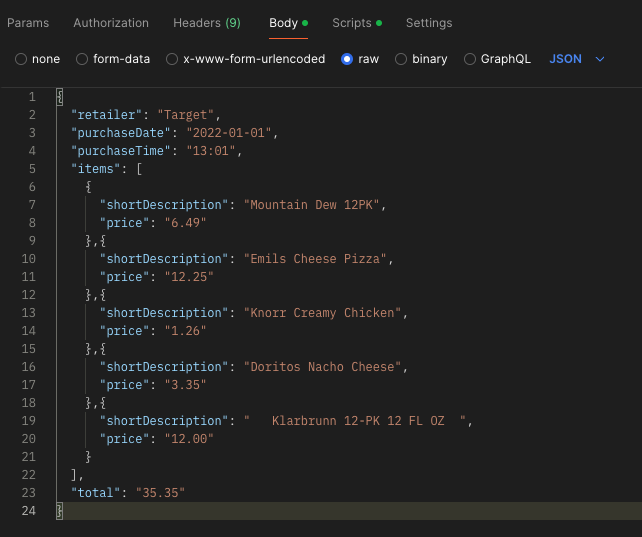
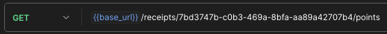

tFetch Backend Project
===============================
## Overview
This is the project for Fetch backend engineer position. 
The project is built by AWS Lambda with Mysql database.

The basic design of the project is to provide two RESTful APIs to get and to upload the data into database.

## Prerequisites
* [Docker installed](https://www.docker.com/get-started/)
* [Mysql installed ](https://dev.mysql.com/downloads/mysql/)
* clone the repository
    `git clone https://github.com/ZhiruiJiang98/Fetch-Reward-Backend-Project.git`
* Maven installed
    `brew install maven`
* [AWS SAM Prerequisites](https://docs.aws.amazon.com/serverless-application-model/latest/developerguide/prerequisites.html)
* [AWS SAM CLI installed](https://docs.aws.amazon.com/serverless-application-model/latest/developerguide/install-sam-cli.html)

### Database setup
1. Login to you local database with using Mysql
    `mysql -h localhost -u root -p`
2. Create a database
     `CREATE DATABASE FetchBackendProject;`
3. Synchronize the schema
    1. Manually implement data
        1. Copy and paste the schema file in
            `~/<your-root>/FetchBackendProject/Database/AwardedPoints.sql`
             copy and paste to the sql terminal and execute.
  
5. modify the required environment variables in the `template.yml` file in the `FetchBackendProjectLambda` folder

### Project setup
1. `cd` to the lambda folder (Reminder: Do not run mvn under the CodeScreen's folder)
  `cd ~/<your-root>/CodeScreen_9hlefyhj/TransactionServiceLambda/`
2. Modify the environment variables in the `service.yml` file
  
3. Build the project
  `mvn clean install package`
4. Starting docker container

### Lambda function local testing
1. Start AWS local API
 `sam local start-api`
  Output should be look like this
 
2. Test the API endpoint with using Postman
   1. `http://<your-local-ip>/receipts/process`
         
         

After the PUT request return the id, you can put it into GET method

   2.`http://<your-local-ip>/receipts/{id}/points`
     

and this api will return the amount of points the id has.